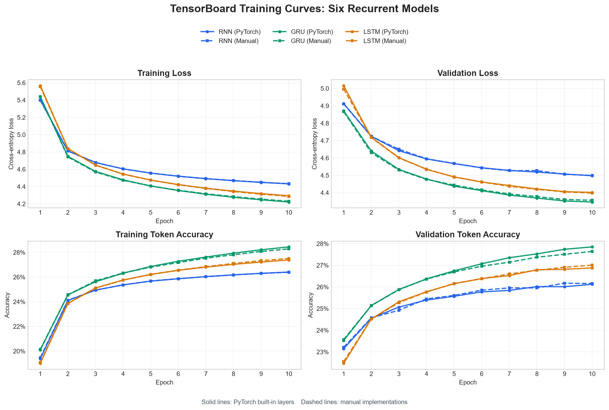

# Chinese Poetry Generation

一个基于 CCPC 数据集的字符级古诗生成学习项目。

基础版当前完成：

1. 用 CCPC 官方训练集、验证集、测试集跑通完整流程。
2. 用字符级 RNN 生成五言或七言绝句。
3. 保留同一套接口，可在内置与手写 RNN、GRU、LSTM 之间切换。

暂时不使用 `title`、`keywords`、`dynasty`、`author` 等条件，也暂时不加入
注意力、Transformer、格律约束、Web 页面和复杂评价指标。

## 项目结构

```text
chinese-poetry-generation/
├─ data/
│  ├─ raw/ccpc/                 # CCPC 原始 train/valid/test 数据
│  └─ processed/                # process.py 生成的模型输入
├─ docs/images/
│  └─ tensorboard_training_curves.png  # 六模型训练曲线
├─ logs/                        # TensorBoard 日志
├─ models/
│  ├─ vocab.txt                 # 只根据训练集建立的字符词表
│  └─ best_rnn.pth              # 验证集损失最低的模型
├─ results/
│  ├─ evaluation_*.json         # 每次评估的完整结果
│  └─ evaluation_history.jsonl  # 所有评估的追加式历史记录
├─ src/
│  ├─ config.py                 # 路径、模型和训练超参数
│  ├─ tokenizer.py              # 字符级编码、解码与词表
│  ├─ process.py                # CCPC 清洗、编码和 padding
│  ├─ dataset.py                # Dataset 与 DataLoader
│  ├─ manual_recurrent.py       # 手写 RNN/GRU/LSTM 时间步与门控公式
│  ├─ model.py                  # RNN/GRU/LSTM 语言模型
│  ├─ train.py                  # 训练、验证、早停和模型保存
│  ├─ evaluate.py               # 测试集 loss/PPL/token accuracy
│  └─ predict.py                # 基础五言、七言采样生成
├─ .gitignore
├─ README.md
└─ requirements.txt
```

## 数据表示

七言绝句会被表示为：

```text
<bos> <qiyan> 第一句 <line> 第二句 <line> 第三句 <line> 第四句 <eos>
```

五言绝句使用 `<wuyan>`，并在 `<eos>` 后补 `<pad>`。模型输入是序列的前
33 个 token，监督目标是向右移动一位后的 33 个 token，因此模型在每个时间步
都学习预测下一个汉字或结构符号。

## 运行顺序

在项目根目录执行：

```powershell
pip install -r requirements.txt
python -m src.process
python -m src.dataset
python -m src.train --model-type rnn
python -m src.evaluate --model-type rnn
python -m src.predict --model-type rnn --form 7 --temperature 0.8 --top-p 0.90
```

每次评估都会在 `results/` 中创建独立 JSON，并向
`evaluation_history.jsonl` 追加一行。记录包括测试集 loss、perplexity、
token accuracy、模型结构参数、训练参数、checkpoint epoch、评估 batch size、
设备和耗时。训练生成的 checkpoint 会保存实际训练超参数，评估时直接读取这些
参数；缺少训练或数据参数的 checkpoint 不再兼容，需要重新训练。评估 JSON 文件
体积很小，可以提交到 GitHub 作为模型对比依据。

生成五言绝句：

```powershell
python -m src.predict --model-type rnn --form 5
```

生成阶段使用 Top-p 核采样。普通位置默认使用 `temperature=0.8、top_p=0.90`；
由于全诗第一个字只有诗体信息作为上下文，默认单独使用
`temperature=1.0、top_p=0.98` 扩大开头候选范围。参数可以直接覆盖：

```powershell
python -m src.predict --model-type rnn --form 7 --temperature 0.8 --top-p 0.9 `
  --first-temperature 1.0 --first-top-p 0.98
```

如需完全贪心生成，需要同时将普通位置和首字 temperature 设为 0：

```powershell
python -m src.predict --model-type rnn --form 7 `
  --temperature 0 --first-temperature 0
```

查看训练曲线：

```powershell
tensorboard --logdir logs
```

## 切换内置和手写循环网络

使用命令行的 `--model-type` 参数切换，不需要修改源代码。可选值分为两组：

```text
PyTorch 内置：rnn、gru、lstm
项目中手写：manual_rnn、manual_gru、manual_lstm
```

例如训练、评估并使用手写 GRU 生成诗歌：

```powershell
python -m src.train --model-type manual_gru
python -m src.evaluate --model-type manual_gru
python -m src.predict --model-type manual_gru --form 7
```

`config.MODEL_TYPE` 现在只作为省略命令行参数时的默认值。训练、评估、生成应
传入相同的模型类型；程序会自动选择对应的 `best_<model_type>.pth`。

六种模型使用相同的数据、词表、训练、评价和生成代码，并分别保存为
`best_rnn.pth`、`best_manual_rnn.pth` 等文件，互不覆盖。手写版本显式计算
隐藏状态和门控，适合学习公式与调试；PyTorch 内置版本使用底层优化实现，正式
训练速度通常明显更快。比较模型效果时可以保持其他超参数一致，但不要用两类
实现的运行速度判断结构优劣。

## 推荐阅读和修改顺序

1. `config.py`：先看清数据路径、序列长度和超参数。
2. `tokenizer.py`：理解“汉字 -> token id”的过程。
3. `process.py`：理解一首诗怎样变成 input 与 target。
4. `dataset.py`：检查 batch 的形状是否都是 `[batch_size, 33]`。
5. `manual_recurrent.py`：逐步理解 RNN、GRU、LSTM 的状态更新公式。
6. `model.py`：理解 embedding、循环层和 linear 的张量形状。
7. `train.py`：理解前向传播、交叉熵、反向传播、验证和 checkpoint。
8. `evaluate.py`：最后一次在测试集上报告泛化结果。
9. `predict.py`：理解自回归生成以及 temperature、top-p 的作用。

建议先用内置 RNN 跑通完整流程，再依次训练内置 GRU/LSTM；理解公式后再切换
`manual_rnn`、`manual_gru`、`manual_lstm`，逐个阅读和调试时间步计算。
不要根据测试集调超参数；超参数选择只看验证集，测试集留给最终比较。

## 六种循环网络实验对比

以下六组实验使用相同的数据、词表和训练配置：`embedding_dim=128`、
`hidden_size=256`、`num_layers=1`、`dropout=0.2`、`batch_size=64`、
`learning_rate=1e-3`、`max_grad_norm=1.0`、`Adam`、`random_seed=42`，均训练
10 个 epoch。实验设备为 NVIDIA GeForce RTX 4060 Laptop GPU，结果来自
`results/evaluation_*.json`，训练耗时由 TensorBoard event 的训练起点到
第 10 个 epoch 记录时间计算。

| 模型 | 参数量 | Valid Loss ↓ | Test Loss ↓ | Test PPL ↓ | Test Token Acc ↑ | 训练耗时 | 评估耗时 |
| --- | ---: | ---: | ---: | ---: | ---: | ---: | ---: |
| RNN（PyTorch） | 2,804,211 | 4.4977 | 4.5059 | 90.55 | 26.23% | 162.9 s | 0.833 s |
| RNN（手写） | 2,804,211 | 4.4996 | 4.5101 | 90.93 | 26.15% | 346.8 s | 1.269 s |
| GRU（PyTorch） | 3,001,843 | **4.3466** | **4.3534** | **77.74** | **27.86%** | 180.5 s | 0.885 s |
| GRU（手写） | 3,001,843 | 4.3567 | 4.3651 | 78.66 | 27.66% | 602.6 s | 2.115 s |
| LSTM（PyTorch） | 3,100,659 | 4.4019 | 4.4107 | 82.33 | 26.96% | 190.9 s | 1.078 s |
| LSTM（手写） | 3,100,659 | 4.3980 | 4.4069 | 82.01 | 27.01% | 559.1 s | 1.912 s |

本次实验可以得到以下结论：

1. 内置 GRU 获得最低的测试 loss 和 perplexity，同时取得最高的 token
   accuracy，是当前配置下效果最好的模型。
2. GRU 和 LSTM 都优于普通 RNN，说明门控状态更新在当前字符级诗歌数据上更有
   利于保留上下文；但不能根据单次实验断言 GRU 在所有任务上都优于 LSTM。
3. 同一结构的内置与手写版本参数量相同，最终指标也很接近，说明手写门控公式和
   训练流程整体是可信的。两者不会得到完全相同的数值，因为参数初始化、权重排列
   和底层计算顺序不同。
4. 手写 RNN、GRU、LSTM 的训练时间分别约为内置版本的 `2.13×`、`3.34×`、
   `2.93×`，评估时间约为 `1.52×`、`2.39×`、`1.77×`。手写实现需要在
   Python 中逐时间步调用许多小算子；PyTorch 内置层可以使用融合后的
   CUDA/cuDNN 内核，因此速度明显更快。
5. 六条验证曲线在第 10 个 epoch 时仍在缓慢改善，且与训练曲线走势一致，暂未
   出现明显发散。是否增加训练轮数应继续根据验证集判断，不能根据测试集调参。

### TensorBoard 训练曲线

下图直接从六次 TensorBoard event 日志读取。实线表示 PyTorch 内置层，虚线
表示手写实现；同一颜色代表相同的循环网络结构。



当前比较只包含一次固定随机种子的实验，token accuracy 也不能完整评价诗歌的
语义、格律和多样性。更严格的结论需要使用多个随机种子，并补充重复率、人工评价
或格律合规率等生成质量指标。

## 数据说明

CCPC 数据集用于学术研究。原始数据和处理后的大文件已在 `.gitignore` 中排除，
